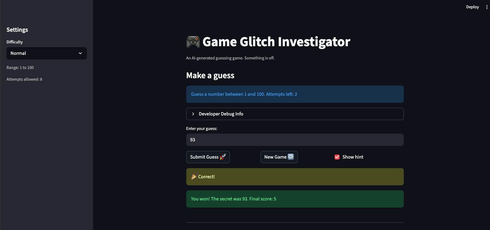

# 🎮 Game Glitch Investigator: The Impossible Guesser

## 🚨 The Situation

You asked an AI to build a simple "Number Guessing Game" using Streamlit.
It wrote the code, ran away, and now the game is unplayable. 

- You can't win.
- The hints lie to you.
- The secret number seems to have commitment issues.

## 🛠️ Setup

1. Install dependencies: `pip install -r requirements.txt`
2. Run the broken app: `python -m streamlit run app.py`

## 🕵️‍♂️ Your Mission

1. **Play the game.** Open the "Developer Debug Info" tab in the app to see the secret number. Try to win.
2. **Find the State Bug.** Why does the secret number change every time you click "Submit"? Ask ChatGPT: *"How do I keep a variable from resetting in Streamlit when I click a button?"*
3. **Fix the Logic.** The hints ("Higher/Lower") are wrong. Fix them.
4. **Refactor & Test.** - Move the logic into `logic_utils.py`.
   - Run `pytest` in your terminal.
   - Keep fixing until all tests pass!

## 📝 Document Your Experience

- [ ] Describe the game's purpose.
   - Purpose was to basically play a guess that number game
- [ ] Detail which bugs you found.
   - The bugs I found were:
      - Hints not working
      - The game allowed the user to make guesses that were not in the bounds.
      - The new game button didnt work
      - The guesses often went to negative 1
- [ ] Explain what fixes you applied.
   - The fixes applied were, first, to modify the hints section to make it give a hint based on the target number and the user input.
   Then fixed the fact that the hints were going based on the numbers divisibility rather than the number itself.
   Then applied a fix to limit user input and reprompt when a guess outside the bounds were made.
   Next fix was to reset the game state when the. user clicked the new game button.

## 📸 Demo

- [ ] [Insert a screenshot of your fixed, winning game here]

## 🚀 Stretch Features

- [ ] [If you choose to complete Challenge 4, insert a screenshot of your Enhanced Game UI here]
